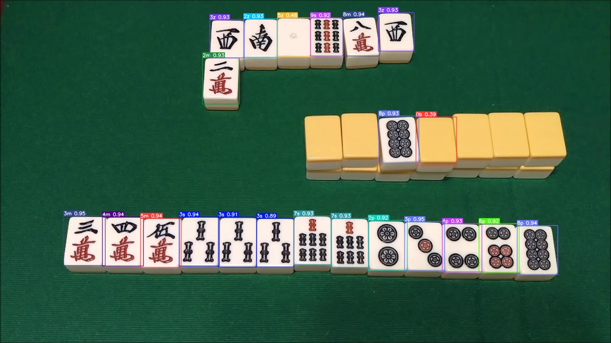
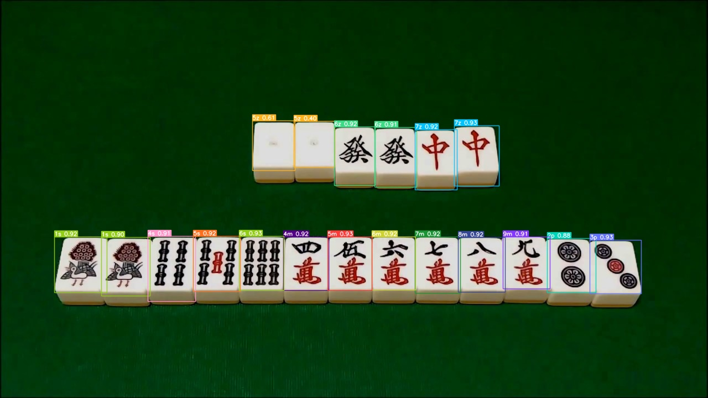

# Mahjong hand calculator app

## Life of Dae-su oh

 - **THIS PROJECT IS STILL UNDER HEAVY DEVELOPMENT**
 - Trained an AI. His name is Dae-su oh from oldboy (2003). 
 - Dont make fun of him, hes shy.
 - I used YOLOv8 with a dataset of ~7000 images of mahjong tiles. 
 - Using vast.ai, i rented 2x 3060 nvidia gpus to train this mofo

 DAE-SUUUUUUUUUUUUU        | OHHHHHHHHHHHHHHHH 
:-------------------------:|:-------------------------:
 | 
